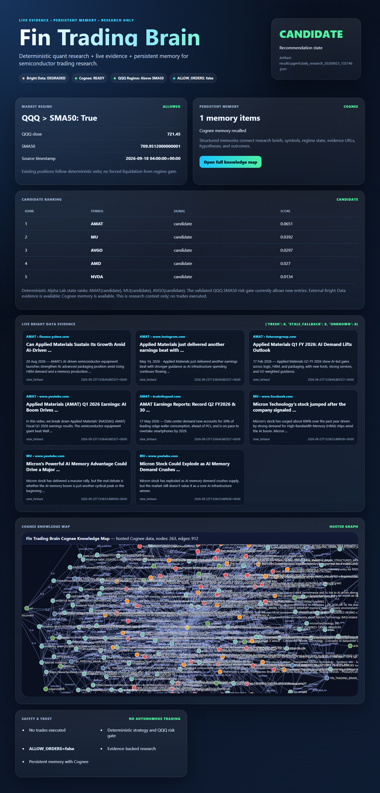
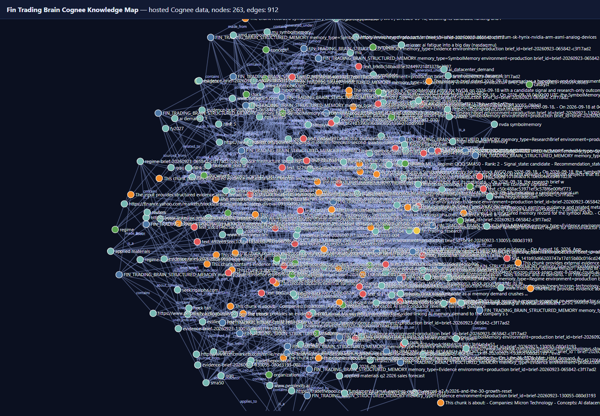

# Fin Trading Brain

Fin Trading Brain is a research-only semiconductor trading intelligence demo. The implemented architecture is intentionally simple:

```text
Alpha Lab deterministic rankings
+ QQQ SMA50 regime/risk gate
-> Bright Data live sourced evidence
-> Cognee structured persistent memory
-> Cognee hosted knowledge graph
-> deterministic research brief
= results/agent/daily_research_*.json
```

`ALLOW_ORDERS=false` must remain set. The project does not expose broker order tools, does not autonomously trade, and does not add new ML models or strategy optimization.

## Demo



### Persistent research knowledge graph



## Implemented architecture

1. **Alpha Lab** loads cached/historical artifacts and emits deterministic rankings with `as_of` timestamps.
2. **Regime/risk** uses the validated QQQ > SMA50 gate to allow/block new long candidates.
3. **Bright Data** performs live SERP/news requests, normalizes results, preserves real URLs, timestamps retrieval, canonicalizes/deduplicates URLs, and reports degraded status instead of fabricating sources.
4. **Cognee** stores structured research memories, recalls prior context, and exposes a hosted knowledge graph when the configured external endpoint supports it; otherwise it degrades gracefully.
5. **Deterministic synthesis** builds a structured research brief without requiring an LLM.
6. **QuantConnect** remains the next independent V1 parity-validation step.

AWS/Bedrock/Strands are **optional / experimental integrations** only. They are not required for preflight, daily research, tests, or demo completion.

## Daily research

```bash
python scripts/daily_research.py
```

Daily flow:

```text
Alpha Lab deterministic state
-> Bright Data live external evidence
-> Cognee structured research memory
-> Cognee hosted knowledge graph
-> deterministic research brief
-> JSON artifact under results/agent/
```

Outputs:
- terminal brief
- JSON artifact under `results/agent/`
- structured Cognee memories tagged with `environment=production`
- no trades executed

Required artifact fields include `brief_id`, `as_of`, `generated_at`, `quant_state`, `regime_state`, `risk_state`, `candidates`, `external_evidence`, `memory_context`, `conflicts`, `limitations`, `recommendation_state`, and `sources`.

Bright Data evidence is stored as first-class structured memory where available, preserving title, canonical URL, source/publisher, snippet, published timestamp when present, retrieval timestamp, deterministic evidence/catalyst type when inferable, query, and relevance context. Missing publisher/date/catalyst fields are left empty rather than fabricated.

## Visual demo

Run the polished local web demo:

```bash
python -m demo.app
```

Open http://127.0.0.1:8765. The demo loads the latest `results/agent/daily_research_*.json`, shows QQQ regime state, ranked semiconductor candidates, Bright Data evidence cards, safety messaging, and an embedded Cognee knowledge map.

Open the map directly:

```text
http://127.0.0.1:8765/graph
```

Capture demo screenshots with Playwright:

```bash
python scripts/demo_playwright.py
```

Outputs are saved under `results/demo/`.

## Live validation commands

```bash
python scripts/preflight.py
python scripts/test_brightdata_live.py
python scripts/ingest_memory.py --file results/agent/<artifact>.json
python scripts/recall_memory.py "MU semiconductor daily research"
```

These commands print safe metadata only and never print credentials.

## Setup

```bash
python -m venv .venv
.venv\Scripts\activate   # Windows
pip install -r requirements.txt
copy .env.example .env
python scripts/preflight.py
pytest -q
```

Configure `.env` only for integrations you want to validate. Do not commit `.env`.

## Environment

Core safety:

```text
ALLOW_ORDERS=false
```

Live evidence:

```text
BRIGHTDATA_API_KEY=...
BRIGHTDATA_SERP_ZONE=...
BRIGHTDATA_API_URL=https://api.brightdata.com/request
```

Persistent memory:

```text
COGNEE_API_KEY=...
COGNEE_ENDPOINT=...
```

Optional / not required:

```text
AWS_REGION=...
AWS_PROFILE=...
STRANDS_MODEL_ID=...
```

## Cognee Knowledge Map

Cognee stores persistent structured research memory and graph data for `ResearchBrief`, `SymbolMemory`, `Regime`, `Evidence`, `Source`, hypotheses, outcomes, and lessons when those facts exist in the pipeline. Fin Trading Brain can render a knowledge-map view of real research memories already persisted to the configured hosted Cognee tenant. It reuses `COGNEE_ENDPOINT`, `COGNEE_API_KEY`, and the `fin_trading_brain` dataset; it does not create a separate local Cognee database.

```bash
python scripts/visualize_cognee.py
python scripts/visualize_cognee.py --query "AMAT QQQ semiconductor research" --max-nodes 300 --depth 2
```

Default output:

```text
results/cognee/fin_trading_brain_map.html
results/cognee/fin_trading_brain_graph.json
```

When hosted Cognee native visualization is available, the HTML is returned by Cognee. If native HTML is unavailable, or if the production map needs to filter explicit test markers from returned hosted graph data, the script falls back to a local HTML rendering of graph nodes/edges returned by hosted Cognee. It does not fabricate graph nodes or relationships. Known limitations: hosted Cognee visualization does not currently expose a metadata-only production filter through this wrapper, so the default query includes `environment production` and the local fallback removes obvious `M7_TEST` nodes when present.

## QuantConnect validation

QuantConnect/LEAN is independent execution validation, not autonomous trading. See `docs/QUANTCONNECT_VALIDATION.md` and `results/validation/schema.json`. No QuantConnect results are claimed unless produced by a real run.

## Safety

- `ALLOW_ORDERS=false` is checked by tests and preflight.
- No buy/sell/order/trade tool is registered with the research agent.
- Bright Data and Cognee credentials are loaded from environment only.
- Source URLs are preserved end-to-end.
- Missing integrations return `DEGRADED`/unavailable metadata rather than mocked success.
